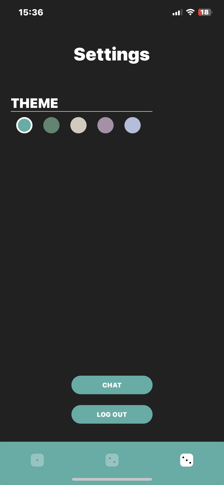

# Company Trombinoscope Application

## Overview

The Company Directory Application is a versatile and user-friendly solution designed to enhance workplace communication and collaboration within your organization. It provides a central hub for employees to access essential information, updates, and resources efficiently. With integrated widgets and a real-time chat feature, this application fosters seamless communication and teamwork, making it an invaluable tool for your company.

## Screenshots

<div align="center">
  
  
  
  
</div>

## Features

- **Widgets**: Access a rich collection of widgets that provide quick access to important company resources and updates.

- **Integrated Chat**: Stay connected with your colleagues through an integrated chat feature, enabling real-time communication and collaboration.

- **Company Directory**: Easily search and find contact information for all employees, helping you stay connected with your coworkers.

- **User-Friendly**: The application is designed with a user-friendly interface, making it accessible for employees at all levels of technical expertise.

## Installation

To get started with the Company Directory Application, follow these steps:

1. Clone this repository to your local machine.

```shell
git clone git@github.com:maxperso/company_trombi.git
```

2. Install the necessary dependencies.

```shell
cd company-trombi
npm install
```

3. Configure the application settings as needed.

4. Run the application.

```shell
npm start
```

## Usage

- Use expoGo to test the application.

- Press just the login button to access the application.

## Contributing

We welcome contributions from the community! If you have any ideas, bug reports, or feature requests, please open an issue or submit a pull request.

## License

This project is licensed under the [MIT License](LICENSE).
```
